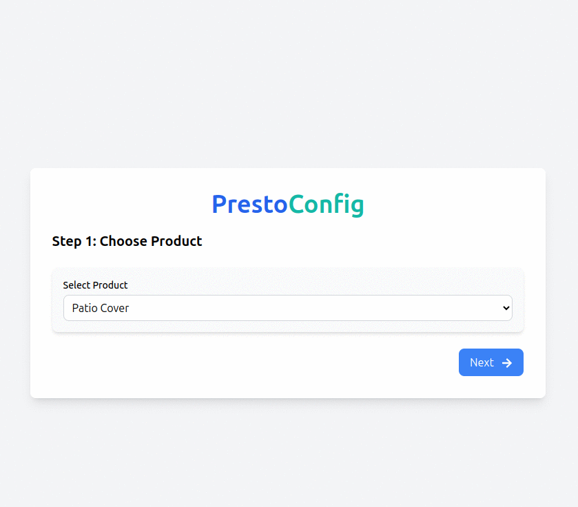

# Presto Config

The purpose of this app is to provide an interactive, step-by-step product configurator that allows users to customize
their selections. Once the user completes the configuration, the app sends the submitted data via email to the selected
branch, enabling efficient processing and handling of the customer’s request.

## Features

### Easy-to-Follow Steps:

- Step-by-step guide to help you configure your product easily, one choice at a time.

### Customizable Product Options:

- Choose from various products (like patio covers, carports, and winter gardens) to configure.
- Select your preferred installation type: attached, freestanding, or request a consultation.

### Adjustable Dimensions:

- Set your product dimensions (width and depth) with simple inputs.

### Color & LED Options:

- Pick your favorite color from available options like anthracite, white, or gray.
- Choose whether you want LED lighting, and if so, select between dimmable or non-dimmable.

### Installation Service Option:

- Decide if you want to opt for installation service along with your purchase.

### Branch Selection:

- Find the nearest branch based on your postal code, and select the one you want to proceed with.

### Personal Information Collection:

- Enter your name, email, and phone number so we can contact you regarding your configuration.

### Final Review & Submission:

- Review all your choices before submitting your configuration request.
- Once submitted, we’ll save your details and send them to the selected branch to process your request.

### Mobile & Desktop Friendly:

- The app is fully responsive, ensuring a smooth experience whether you’re using a desktop or a mobile device.

## Technologies Used
- React
- Node.js
- Express
- Nodemailer
- Tailwind CSS
- MySQL
- Sequelize
- Cors
- Axios

## Installation
Read the installation instructions in the [frontend](frontend/README.md) and [backend](backend/README.md) directories.

## Preview

Thank you for using Presto Config! 🚀